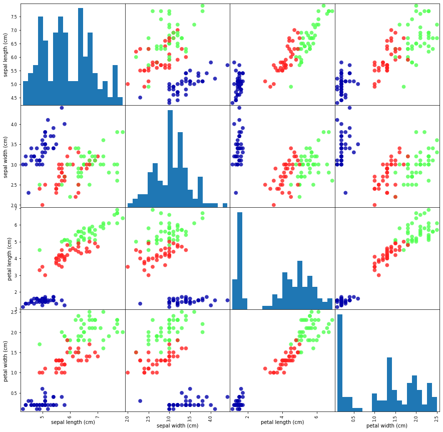

# KNN-Classification
Using KNN : K-Nearest Neighbors algorithm to identify class of flowers based on sepal and petal length, sepal and petal width.

## Packages 
mglearn : mglearn package is installed using command `pip install mglearn`.

## Libraries
- numpy and pandas are used for data manipulation and plotting.
- sklearn is used for splitting the data-set into training and testing data.

## KNN Algorithm 
The k in K-nearest neighbors signifies that imstead of using only the closest neighbor to the new data point, we can consider any fixed number k of neighbors in the training. Then, we can make a prediction using the majority class among these neighbors.
The `k-nearest neighbors` classification algorithm is implemented in the KNeighborsClassifier class in the neighbors module.

## Results 

The below plot gives us the distribution of features : `sepal length`, `sepal width`, `petal length` and `petal width`.
It also tells us the relationship between the variables and points have been coloures based on the flower labels.

After predicting the results from test data, we got the accuracy as `0.97` which is quite good. 
